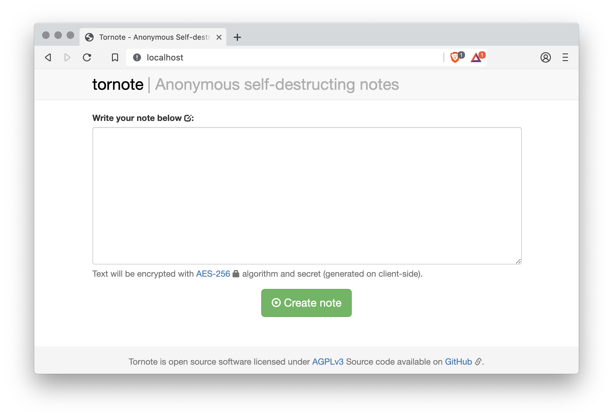

# Tornote



[](https://travis-ci.org/osminogin/tornote) [](https://coveralls.io/github/cig0/tornote?branch=master)

Anonymous self-destructing notes written in Go with help of Stanford JavaScript Crypto Library ([SJCL](https://crypto.stanford.edu/sjcl/)) on client-side.

The server stores only encrypted data. JavaScript must be enabled, because notes are decrypted in the web browser using the key from the secret link. After reading the encrypted note, it is immediately removed from the database.

## Security

How safe Tornote is compared with other similar services? More than many of them.

+ All private data in clear text doesn't leave the client-side without being encrypted first
+ Server stores only anonymous encrypted data, without any reference to it's author or reader
+ Note decryption is executed on the client-side via the SJCL. After reading the encrypted note, it's data is removed from the server

If you have ideas to improve safety/security please open a new issue.

## Running with Docker

```bash
$ docker build --no-cache -t tornote .
$ docker run --name tornote -p 80:8080/tcp --memory 10m --memory-reservation 8m --cpus 0.10 tornote
```

## License

AGPLv3 or later

----

### TO DO (in no particular order)

```diff
+ [ DONE ] Move away from any 'latest' declaration for packages versions
+ [ DONE ] Migrate from golang:1.12.4-stretch to a smaller base
+ [ DONE ] Added package.json for future migration from Bower to Yarn
+ [ DONE ] Tornote is now running as a limited user (instead of as root) for enhanced security
+ [ DONE ] Create a multi-stage Dockerfile
- Migrate from Bower to Yarn
- Fix testing & badges
```

### Repo notice

#### Branches description

+ **master**: production-ready branch; this is the branch that should be pulled when running this app in production
+ **stage**: a.k.a. release branch
+ **dev**: development branch; all work branches have to be merged here

#### How to contribute

Fork the repo and PR against `dev` branch.

All credits goes to the original author, thank you [Vladimir Osintsev](https://github.com/osminogin) for sharing!
